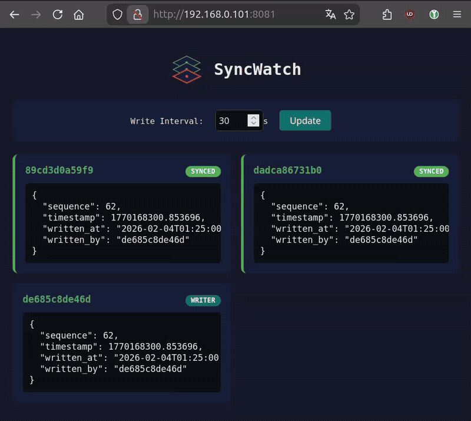

# SyncWatch

<p align="center">
  
</p>

<p align="center"><b>Real-time volume sync monitor for Docker Swarm</b></p>

Displays sync status across all nodes with a live web dashboard. Detects discrepancies in replicated volumes instantly.



## How it works

1. **Writer node** (lowest IP) writes a test file (`.consistency_test.json`) at a configurable interval (default 30s)
2. **All nodes** read the test file and report their view via API
3. **Dashboard** aggregates all nodes and shows sync status in real-time

## Architecture

| Service | Mode | Description |
|---------|------|-------------|
| `image-exporter` | global | Exports Docker image to shared volume (only succeeds on build node) |
| `image-importer` | global | Loads image from shared volume, coordinates node readiness |
| `syncwatch` | global | Checker service running on all nodes |
| `dashboard` | single | Web dashboard (port 8081) |

## Usage

### 1. Build on ONE node only

```bash
git clone https://github.com/SuitDeer/SyncWatch.git
cd SyncWatch
sudo docker build -t syncwatch:latest .
```

### 2. Deploy stack

Please change `/var/syncthing/data` path to your replicated storage:

```bash
sudo docker stack deploy -c docker-compose.yml syncwatch
```

### 3. Wait for image distribution

- The `image-exporter` exports the image to the shared volume.
- The `image-importer` loads it on each node and waits for all nodes to be ready.

```bash
# Check export status (one node will show "Image exported!")
sudo docker service logs syncwatch_image-exporter -f

# Check import status
sudo docker service logs syncwatch_image-importer -f
```

### 5. View dashboard

Open `http://<any-node-ip>:8081` in your browser.

---

### File Usage

| File | Purpose |
|------|---------|
| `.consistency_test.json` | Test file written by writer node |
| `.syncwatch_config.json` | Shared configuration |
| `.syncwatch.tar` | Docker image (temporary, during distribution) |
| `.syncwatch.ready.*` | Node readiness markers (temporary) |
